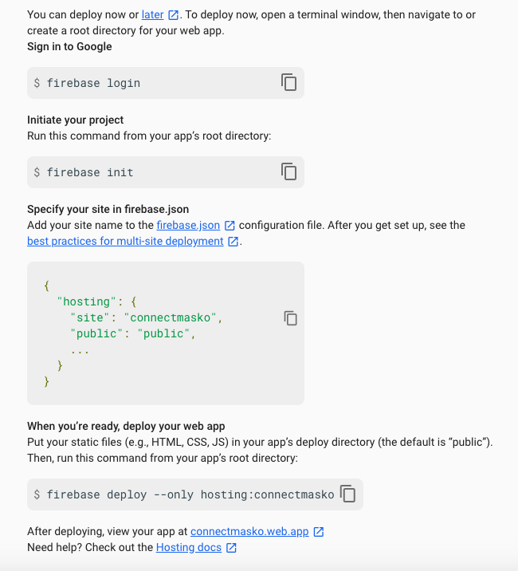

# Important links

- [Getting Started with the Firebase Realtime Database on the Web, Part 1 - Firecasts](https://www.youtube.com/watch?v=noB98K6A0TY&feature=emb_rel_end)
- [Get Started on Web | Firebase](https://firebase.google.com/docs/storage/web/start)
- [Add Firebase to your JavaScript project](https://firebase.google.com/docs/web/setup?authuser=0)
- [Firebase JavaScript SDK Reference](https://firebase.google.com/docs/reference/js/?authuser=0)
- [Firebase CLI reference](https://firebase.google.com/docs/cli/?authuser=0)
- [Firebase CLI reference (JSON file)](https://firebase.google.com/docs/cli?authuser=0#the_firebasejson_file)
- [Multisite deployment](https://firebase.google.com/docs/hosting/multisites?authuser=0#set_up_deploy_targets)

### Process

